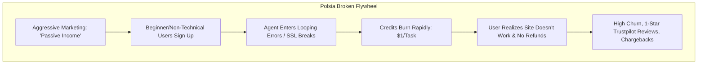
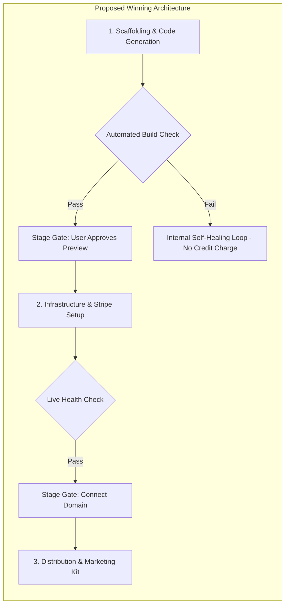

# Strategic Feasibility & Business Model Viability Analysis: Competing with Polsia

**Target Market:** Autonomous AI Business Creation & Management Platforms  
**Audience:** Prospective Founder / Competitor Analysis  
**Reference Benchmark:** Polsia (`polsia.com`)

---

## 1. Executive Verdict: Is the Model Viable?

> **Verdict: Highly Viable in Market Demand, but Polsia's Specific Execution Model is Structurally Flawed.**
>
> The desire for a "one-click business" or "autonomous AI co-founder" is one of the highest-intent, highest-converting value propositions in tech today. However, **Polsia’s current business and operational model is a recipe for high churn, user distrust, and platform death.** 
>
> If you launch a competing platform, **you should not copy their architecture or pricing**. Instead, you can capture significant market share by solving the exact failure modes that make Polsia's customers furious.

---

## 2. Why Polsia's Current Business Model is Failing Its Users

Polsia’s model suffers from what venture capitalists call **"Incentive Misalignment & The Leaky Bucket Problem"**:

### The 4 Fatal Flaws in Polsia's Business Model:

1. **Misaligned Monetization (The "Bug Tax"):**
   * Polsia charges \$49/mo **PLUS** ~$1 per task credit **PLUS** a 20% revenue/ad-spend cut.
   * When an agent makes a mistake, hallucinates, or loops 15 times trying to fix an invalid CSS property, **the user gets billed $15 for the platform's failure**. This feels predatory to customers and leads directly to chargebacks and reputational ruin.
2. **The "Passive Income" Audience Trap:**
   * By marketing "businesses that run while you sleep," Polsia attracts **the lowest-LTV, highest-support-burden customers**: non-technical opportunists hoping for free money. When these users encounter a basic DNS propagation delay or a Stripe identity verification prompt, they flood customer support and demand refunds.
3. **The "Jack of All Trades" Software Quality Gap:**
   * A full-stack business requires: reliable backend/frontend code, deliverable email setups (SPF/DKIM/DMARC), high-converting ad creative, and compliance. By attempting to do all of them with generalist LLM wrappers, Polsia outputs mediocre quality in every single vertical.
4. **Vendor Lock-In (The "Hostage" Trap):**
   * Polsia hosts the code on proprietary infrastructure. Serious founders who start making money will **immediately abandon the platform** to avoid paying a 20% tax on an app they don't even own.

---

## 3. The Winning Blueprint for a Competing Platform

To build a venture-scale, profitable competitor, shift from an *"unreliable magic trick for amateurs"* to an **"indispensable execution engine for creators and operators."**

### 3.1. How to Fix the Monetization Model

| Dimension | Polsia (What to Avoid) | Your Platform (How to Win) |
| :--- | :--- | :--- |
| **Pricing Structure** | $49/mo + $1/credit + 20% revenue cut | **Predictable Flat SaaS Tier or Fair Credit Metering** (e.g., $39/mo or $79/mo with generous fair-use runs). |
| **Failed Runs** | Burns customer credits on agent failure loops | **Zero-Charge Failure Guarantee**: Credits are only consumed on verified task success (verified via HTTP status codes & test passes). |
| **Code Ownership** | Proprietary walled garden | **Full Git Ejection (Export to GitHub / Vercel)**. The user owns their repository 100%. |
| **Revenue Take-Rate**| 20% perpetual tax | **0% revenue tax** (or a clean 1-2% payment processing add-on only if you provide the merchant-of-record). |

---

### 3.2. Architecture: Human-in-the-Loop "Stage Gates" vs. "God Mode"

Polsia's biggest technical mistake is unsupervised 7-day "God Mode" that hallucinates tasks as complete. 

Instead, build **"Autonomous Execution with Stage-Gate Verification"**:

* **Why this wins:** Users do not mind clicking "Approve" at 3 key milestones. In fact, it gives them confidence that the code actually compiles, the SSL certificate is valid, and the Stripe webhook is functional before spending ad dollars.

---

### 3.3. Target Customer Positioning: Who Actually Pays and Retains?

Stop marketing to "make money online while you sleep" audiences. Target:
1. **Indie Hackers & Solo Developers:** People who have coding skills but hate writing marketing copy, legal terms, and landing page scaffolding.
2. **Agencies & Freelancers:** People who build landing pages and micro-apps for clients and want to 10x their turnaround time.
3. **Domain Name Investors & Idea Hoarders:** People with 50 unused domain names who want to rapidly deploy validated MVPs to test organic search traffic.

---

## 4. Financial & Unit Economics Feasibility

### Cost of Goods Sold (COGS) Breakdown:
* **LLM Reasoning & Orchestration:** Using modern cost-efficient models (e.g., Claude 3.5 Haiku, Gemini 1.5 Flash / 2.0 Flash) for routine agent steps and reserving frontier models (Claude 3.7 Sonnet / GPT-4o) only for core architectural generation reduces raw token costs per business launch to **between $0.80 and $3.50**.
* **Hosting & Provisioning:** Integrating with standard cloud APIs (Fly.io, Vercel, Supabase, Cloudflare Workers) keeps infrastructure COGS under $1/month per active tenant during MVP phases.

### Projected Unit Economics:
* **Target ARPU:** $49–$99/month.
* **Estimated Gross Margin:** 70% – 85% (if agent loops are bounded and self-healing token usage is optimized).
* **Defensibility:** Your moat will not be the raw AI model (everyone uses the same APIs). Your moat will be **scaffolding reliability, 1-click domain/payment plumbing, and clean Git exportability**.

---

## 5. Next Steps to Validate Your Venture

1. **Build a "Wizard of Oz" or Curated MVP:** Manually or semi-automatically generate 5 real micro-SaaS projects for test users using Cursor + Supabase + Stripe to identify where automated tools break.
2. **Test the Positioning:** Run a simple landing page offering *"The AI Co-Founder that gives you 100% code ownership and never burns credits on bugs."* Measure conversion against Polsia's messaging.
3. **Focus on Vertical Plugs:** Build first-class integrations with GitHub, Supabase, and Stripe before attempting full marketing automation.
