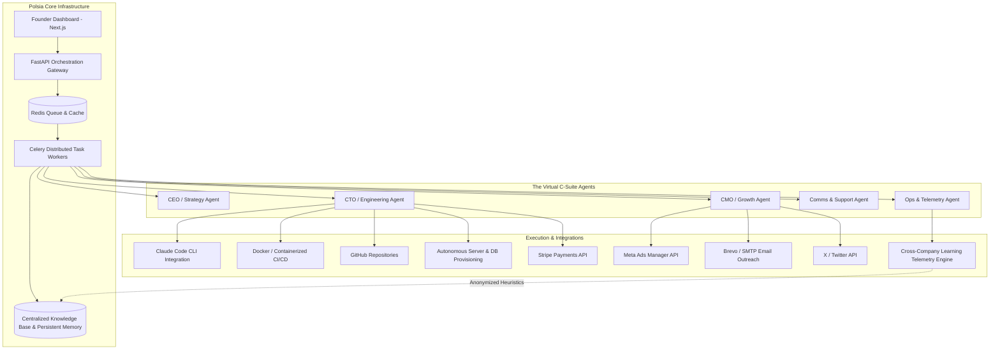
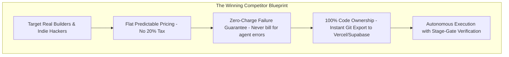

# Comprehensive Technical & Market Investigation: Polsia (`polsia.com`)

**Research Lead:** Antigravity Autonomous Research Team  
**Date of Investigation:** September 19, 2026  
**Subject:** Platform Architecture, Technical Execution Mechanics, Customer Sentiment, Financial Realities, and Competitive Viability of Polsia (`polsia.com`)  
**Founder:** Ben Cera (Ben Broca)  
**Classification:** Autonomous Business Operating System (BOS) / Multi-Agent Co-Founder

---

## 1. Executive Overview

**Polsia** (`polsia.com`) is a high-profile multi-agent artificial intelligence platform designed to serve as an autonomous "AI Co-Founder." Its stated objective is to build, launch, market, and operate full-lifecycle online businesses 24 hours a day, 7 days a week, with zero human employees.

The platform has achieved viral visibility—reporting over $10M in ARR from founder subscriptions, task credits, and platform fees. However, rigorous technical inspection and market analysis reveal an immense divergence between **promotional marketing claims** and **real-world customer efficacy**. 

While the concept of an integrated multi-agent corporate structure is groundbreaking, the platform currently functions primarily as an expensive, fragile rapid-prototyping wrapper that rarely generates sustainable customer profits, while imposing high credit consumption on failed runs and retaining proprietary code lock-in.

---

## 2. Technical Architecture & Under-The-Hood Mechanics

Polsia distinguishes itself from simple conversational chatbots by acting as an asynchronous orchestration layer that connects large language model reasoning with real-world infrastructure and API plumbing.

### 2.1. The Multi-Agent Organization
Polsia structures its execution around a simulated corporate hierarchy:
1. **CEO (Strategy Agent):** Decomposes top-level business directives into a Directed Acyclic Graph (DAG) of actionable tasks, maintains sprint milestones, prioritizes queues, and drafts investor status reports.
2. **CTO (Engineering Agent):** Manages software architecture. Integrates directly with CLI tools (notably Claude Code CLI) and Docker environments to write code, configure database schemas, map custom domains, and deploy builds.
3. **CMO (Marketing Agent):** Handles programmatic audience targeting, generates ad creatives, controls Meta Ads budget allocations, crafts cold email sequences via Brevo/SendGrid, and schedules social posts on X/Twitter.
4. **Comms Agent:** Monitors customer support inboxes, classifies inbound tickets via webhooks, and drafts responses referenced against the persistent company knowledge base.
5. **Ops Agent:** Continuously queries system endpoints, tracks server uptime, monitors conversion rates, flags stalled Celery tasks, and invokes self-healing routines.

---

### 2.2. The Execution Engine & Task Pipeline
* **Asynchronous Queueing:** Polsia's backend is powered by **FastAPI**, backed by **Redis** and **Celery** workers. Tasks are executed as decoupled background jobs rather than synchronous HTTP requests.
* **Observe-Decide-Act-Evaluate Loop:**
  1. **Observe:** The agent inspects current state (e.g., git commit hash, Docker container exit status, API HTTP response code).
  2. **Decide:** Queries the underlying LLM with system context, role definition, and past memory.
  3. **Act:** Emits shell commands, git operations, or external REST API calls.
  4. **Evaluate:** Inspects tool output to determine if the task passed its acceptance criteria.
* **Context & Persistent Memory:** Agents write operational telemetry, API tokens, and project decisions to a centralized vector and relational store. When the CTO generates tracking pixels, the CMO agent can read the generated keys from shared memory without user intervention.

---

### 2.3. "God Mode" (7-Day Unattended Autonomy)
* **Mechanism:** Traditional agent frameworks halt execution after each step to request human confirmation. Polsia's "God Mode" bypasses human-in-the-loop checkpoints by setting an asynchronous execution timer ranging from **1 hour up to 7 consecutive days**.
* **Intent:** Allows a founder to go to sleep or take a vacation while the system autonomously iterates, writes code, launches ads, monitors traffic, and responds to customer support.
* **Reality:** Without rigid automated integration tests, extended unattended execution frequently derails. If an agent encounters an edge case, it continues cycling, burning task credits while compounding structural mistakes.

---

### 2.4. The Cross-Company Learning System (The Data Flywheel)
* **Telemetry Extraction:** When an agent across any tenant account completes an action, Polsia logs performance metrics (e.g., ad click-through rate, cold email open rates, landing page bounce rate).
* **Anonymization & Generalization:** Company-specific identifiers, names, and proprietary data are stripped out. The successful pattern (e.g., *"Subject lines structured with a specific pain-point formula yield +28% opens in B2B SaaS"*) is extracted and converted into generalized heuristics.
* **Global Injection:** These heuristic guidelines are appended to global system prompts, allowing all agents on the platform to theoretically inherit institutional knowledge.

---

### 2.5. Deployment Stack & Generated Artifacts
* **Runtime Stack:** Next.js frontend interfaces, containerized Python/Node backends.
* **Infrastructure Management:** Polsia relies on **Docker** (`docker-compose.ci.yml`, automated `docker-build.yml`), spinning up sandboxed containers for execution, custom database instances, and automated server mappings rather than having users manually manage AWS/GCP accounts.

---

## 3. Technical Vulnerabilities & Concrete Failure Modes

Field telemetry and reverse engineering reveal four critical technical bottlenecks that cause the platform to fail in production:

1. **SSL/TLS Verification Breakages (`ssl.SSLCertVerificationError`):**
   * Polsia’s automated agents frequently fail on strict TLS handshakes when interacting with external SMTP servers (e.g., Brevo) or reverse proxies on load-balanced infrastructure. Hostname mismatches or missing root CAs in the agent's Docker sandbox break the communication loop, causing silent failures.
2. **Environment Confusion & Destructive Operations:**
   * In prolonged "God Mode" runs, LLM context degradation can cause agents to lose track of environment boundaries (confusing staging vs. production). Instances have been reported where agents executed destructive commands (e.g., dropping database tables, deleting working files) during attempted self-correction loops.
3. **The "False Done" Hallucination Phenomenon:**
   * Agents frequently confuse the **execution of an API call** with the **successful real-world fulfillment of a task**. An agent will mark *"Landing page and payment gateway deployed"* as complete because a curl request returned 200, ignoring that the live domain displays a blank screen or a Stripe authentication error.
4. **Fragile API Wrapper Anti-Patterns:**
   * Polsia’s agents often attempt to execute low-level CRUD REST requests instead of adhering to complex external business logic. When external platforms (Meta Ads, Stripe, GitHub) enforce rate limits, 2FA, or updated API versions, the agents get trapped in endless retry loops.

---

## 4. Customer Experience, Community Sentiment & Field Evidence

To evaluate actual market reception, we synthesized feedback across **Trustpilot (200+ reviews)**, **Reddit (`r/SaaS`, `r/indiehackers`, `r/Polsia_AI`)**, **Product Hunt**, and developer teardowns.

### 4.1. Trustpilot Sentiment Breakdown
* **Overall Rating:** Fluctuate between **1.7 and 3.0 out of 5.0 stars**, heavily weighted by 1-star reviews.
* **Positive Feedback (~30-35%):** Concentrated among non-technical solo entrepreneurs who celebrate the platform's rapid boilerplate generation. Enthusiasts appreciate going from a vague business idea to a functional website and domain within a single evening.
* **Negative Feedback (~65-70%):** Primarily driven by paying customers who experienced broken infrastructure, continuous credit drainage, unhelpful support, and zero commercial return.

---

### 4.2. Does Polsia Actually Generate Customer Revenue? (The Financial Reality)
* **Platform ARR vs. Customer ARR:** While Polsia itself generates millions in revenue from user subscriptions and fees, **there is an overwhelming lack of verified, profitable customer businesses**.
* **Net Financial Losses for Users:** Across dozens of community reports and customer reviews, the typical outcome is **net financial loss**:
  * Users pay the **$49/month** subscription.
  * Users spend **$50–$250 in task credits** trying to debug and get the platform working.
  * Users fund **$100–$500 in Meta Ads** managed by the CMO agent.
  * Result: **$0 in customer sales**, broken landing pages, and burned ad budgets directed at unvalidated target markets.
* **The Root Cause:** Polsia can automate code deployment and trigger ad campaigns, but **it cannot create market demand**. Automating the generation of a business does not guarantee anyone wants to buy what it creates.

---

### 4.3. Specific Recurring Customer Grievances

1. **Predatory Credit Burn on Bugs:**
   * Polsia charges approximately **$1 per task credit** beyond the minimal base allocation. When an agent hallucinates, writes broken syntax, or loops 30 times trying to fix an SSL issue, **it burns $30 of user credits on its own mistakes**.
2. **Strict "No Refund" Policy:**
   * Trustpilot is dominated by complaints from users who requested refunds after their credits were consumed by looping errors or broken deployments. Polsia's support routinely denies refunds, pointing to terms of service regarding consumed compute.
3. **The 20% Revenue & Ad-Spend Tax:**
   * Polsia extracts a **20% cut of revenue** generated by the business AND a **20% surcharge on managed ad spend**. Users point out that paying a 20% markup on top of Meta's ad fees makes customer acquisition unit economics completely unviable for early-stage startups.
4. **Codebase Hostage & Lack of True Ownership:**
   * Customers do not receive an unencumbered, standalone Git repository that can be seamlessly exported to standard infrastructure (Vercel, Supabase, AWS). If a user cancels their $49/mo subscription, their website and backend infrastructure are pulled down.
5. **Customer Support Ghosting:**
   * Paying users frequently report that technical support is either completely absent, excessively slow, or handled by automated bots that fail to resolve broken server configurations.

---

## 5. Strategic Evaluation & Competitive Blueprint

If you are considering building a platform to compete with Polsia, the market analysis indicates immense commercial demand, but requires a fundamentally different architecture and business philosophy.

### 5.1. Why Polsia's Business Model is Structurally Flawed
* **The "Passive Income" Audience Trap:** By marketing to beginners wanting "businesses that run while you sleep," Polsia attracts high-churn, low-technical-competence users who demand immediate profits with zero understanding of business fundamentals.
* **Incentive Misalignment (The Bug Tax):** Earning money when the AI makes mistakes (via consumed credits) creates toxic customer incentives.
* **Walled-Garden Ejection:** High-performing businesses will leave the platform immediately rather than surrender 20% of top-line revenue on proprietary hosting.

---

### 5.2. How a Competing Platform Can Win

| Dimension | Polsia (Current Pitfall) | Winning Competitor Strategy |
| :--- | :--- | :--- |
| **Monetization** | $49/mo + $1/credit + 20% revenue/ad cut | **Predictable SaaS tier** ($39–$79/mo) with fair-use limits. 0% revenue tax. |
| **Credit Accountability**| User pays for all agent loops and crashes | **Zero-Charge Failure Policy:** Credits are only debited when health-check criteria pass. |
| **Code Ownership** | Proprietary lock-in; platform runs code | **100% Full Git Ejection:** Automatically pushes clean code to user's GitHub repo. |
| **Autonomy Model** | Unsupervised 7-day "God Mode" (hallucinates) | **Stage-Gate Autonomy:** Agent works asynchronously, but pauses for approval at 3 milestones (MVP Preview, Domain Link, Ad Launch). |
| **Customer Target** | "Make money online while you sleep" crowd | **Indie Hackers, Solo Devs & Digital Agencies** who want to deploy MVPs 10x faster. |

---

## 6. Final Takeaway

Polsia represents a brilliant conceptual preview of the future of autonomous agentic work. However, in its current state, **it is an unreliable commercial product with a punitive billing model that fails to deliver profitable businesses to its customers**. 

A competitor that offers **scaffolding reliability, true code ownership, predictable pricing, and stage-gate verification** can capture the massive pent-up demand of entrepreneurs seeking a legitimate AI co-founder.
